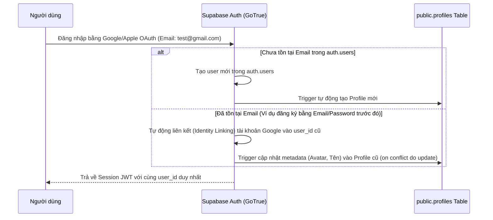

# Thiết Kế Kỹ Thuật Supabase: Webapp Hung Trinh AI

Tài liệu này đặc tả chi tiết kiến trúc cơ sở dữ liệu, cơ chế xác thực đa kênh (Email/Password, Google OAuth, Apple OAuth), logic liên kết tài khoản tự động (Identity Linking), mô hình phân quyền và mã nguồn SQL schema hoàn chỉnh để chạy trực tiếp trên Supabase SQL Editor.

---

## 1. Flow Xác Thực & Liên Kết Tài Khoản (Auth Flow & Identity Linking)

Để mang lại trải nghiệm mượt mà nhất cho người dùng và tránh việc trùng lặp hồ sơ khách hàng, hệ thống áp dụng cơ chế tự động liên kết danh tính dựa trên Email (Automatic Email Identity Linking):



### 1.1. Logic chống tạo trùng tài khoản & Identity Linking
1.  **Cấu hình trên Supabase Dashboard**: Bắt buộc bật tùy chọn **"Link identities with the same email address"** trong phần *Authentication Settings -> Provider Settings*.
2.  **Đăng ký bằng Email + Mật khẩu**: Tạo user trong `auth.users` -> Cần xác nhận email (nếu bật email confirmation) -> Gửi mã OTP xác nhận -> Kích hoạt tài khoản -> Trigger tạo hồ sơ trong `public.profiles`.
3.  **Đăng nhập bằng Google OAuth**: 
    *   Nếu email Google trùng với tài khoản Email/Password đã có: Supabase liên kết tài khoản Google này vào user đã có trong `auth.users`. User_id (`uuid`) không đổi. Trigger SQL xử lý xung đột bằng cách `ON CONFLICT (id) DO UPDATE` để cập nhật thông tin họ tên, avatar mới nhất từ Google mà không sinh ra dòng mới.
    *   Nếu email Google chưa tồn tại: Supabase tạo user mới và trigger tạo profile với role mặc định là `student`.
4.  **Quên mật khẩu / Đặt lại mật khẩu**: Sử dụng luồng chuẩn của Supabase: `supabase.auth.resetPasswordForEmail(email)`. Hệ thống gửi link chứa token khôi phục mật khẩu. Khi học viên click vào link, Next.js bắt token và điều hướng vào trang đặt lại mật khẩu của Portal học viên.

---

## 2. Cơ Chế Phân Quyền Chi Tiết (Role & Access Control)

Hệ thống định nghĩa 4 vai trò (Roles) trong cột `role` của bảng `public.profiles`:
1.  **admin**: Toàn quyền đọc/ghi trên tất cả các bảng.
2.  **team_leader (Trưởng nhóm)**: Xem toàn bộ dữ liệu thuộc về nhóm do mình quản lý (bao gồm dữ liệu của các thành viên trong nhóm).
3.  **sales (Nhân viên kinh doanh)**: Chỉ xem và quản lý dữ liệu (leads, tasks) được phân công trực tiếp cho mình.
4.  **student (Học viên)**: Chỉ xem thông tin cá nhân và lịch sử đăng ký học/webinar (subscriptions) của chính mình.

### 2.1. Giải pháp chống đệ quy chính sách RLS (Preventing RLS Infinite Recursion)
Để tránh lỗi truy vấn đệ quy khi viết RLS Policy (ví dụ: Policy của `profiles` lại truy vấn bảng `profiles`), chúng ta xây dựng các hàm Helper SQL được cấu hình ở chế độ `SECURITY DEFINER` và `STABLE` để cache và bỏ qua RLS khi truy vấn:
*   `public.get_user_role(user_uuid)`: Lấy vai trò của người dùng hiện tại (Bypass RLS).
*   `public.is_member_of_my_team(leader_uuid, member_uuid)`: Kiểm tra thành viên thuộc nhóm do trưởng nhóm quản lý.
*   `public.check_is_team_member(user_uuid, team_id)`: Kiểm tra xem user có phải thành viên của team không.
*   `public.check_is_team_leader(user_uuid, team_id)`: Kiểm tra xem user có phải trưởng nhóm của team không.
*   `public.check_list_owner_or_team(user_uuid, list_id)`: Kiểm tra xem chiến dịch có do user hoặc thành viên trong team của user tạo ra hay không.

---

## 3. Sơ Đồ Quan Hệ Thực Thể (Entity-Relationship Diagram)

```
[auth.users] (Supabase Auth)
      │ (1:1 cascade)
[public.profiles] 
      │ (1:N)                       ┌───[team_members] (N:M bridge)
      ├─────────────────────────────┤         │
      │ (leader_id 1:N)             └───[teams]
      ├─────────────────────────────[lead_lists] (created_by 1:N)
      ├─────────────────────────────[leads] (assigned_to 1:N)
      ├─────────────────────────────[tasks] (assigned_to 1:N)
      ├─────────────────────────────[subscriptions] (user_id 1:N)
      └─────────────────────────────[activity_logs] (user_id 1:N)

[leads]
      ├───[lead_tags] (lead_id 1:N cascade)
      ├───[pipeline_stages] (stage_id 1:N)
      └───[lead_lists] (list_id 1:N)
```

---

## 4. Mã Nguồn SQL Schema Hoàn Chỉnh (`schema.sql`)

Mã nguồn SQL này đã được tinh chỉnh tối ưu và lưu độc lập tại [supabase_schema.sql](file:///Users/hungtrinh/Documents/AI%20BUSINESS/Webapp-AI-Trainer/supabase_schema.sql) để bạn dễ dàng sao chép và chạy trên Supabase SQL Editor.

Các bảng và chính sách được thiết kế chuẩn xác để tuân thủ màu sắc thương hiệu và quy tắc phân quyền người dùng của Visun Group.

---

## 5. Đề Xuất Giải Pháp Xử Lý Chéo Phương Thức Đăng Nhập

### Trường hợp 1: User đã đăng ký tài khoản Email/Password trước, sau đó bấm đăng nhập bằng Google OAuth.
*   **Vấn đề**: Tài khoản Google sử dụng chung email `test@gmail.com`.
*   **Giải pháp**: Khi bật tính năng **"Link identities with the same email address"** trên Supabase, GoTrue sẽ không tạo tài khoản mới. Thay vào đó, nó sẽ tạo thêm một dòng trong bảng `auth.identities` gắn Google làm nhà cung cấp thứ hai cho `user_id` đã có. Trạng thái profile, role và dữ liệu lịch sử của học viên được bảo toàn nguyên vẹn.

### Trường hợp 2: User đã đăng nhập bằng Google OAuth trước, sau đó muốn đăng ký bằng Email/Password.
*   **Giải pháp**:
    *   Học viên nhập email Google vào form đăng ký và mật khẩu mới.
    *   Supabase sẽ phát hiện email này đã tồn tại và gửi email xác nhận.
    *   Sau khi xác nhận mật khẩu, Supabase liên kết phương thức đăng nhập bằng mật khẩu (Password Identity) vào `user_id` hiện tại của tài khoản Google đó. Học viên có thể đăng nhập bằng cả hai cách.
